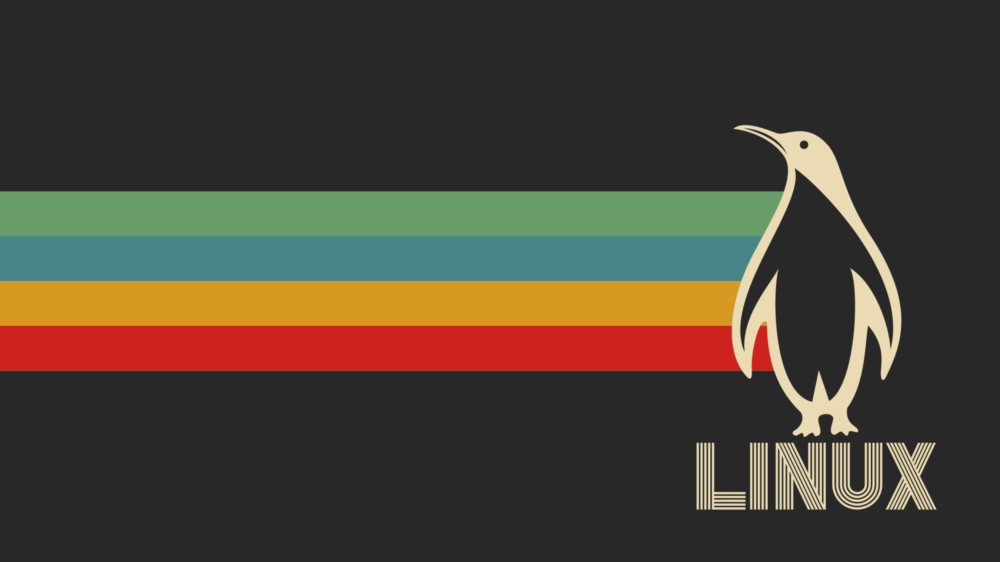
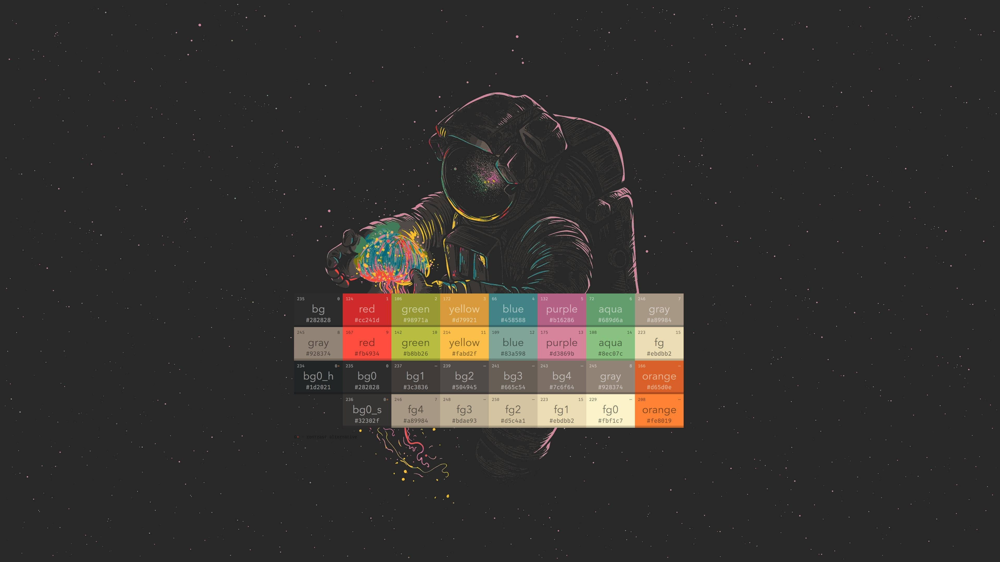

# Gruvbox Solitude for Omarchy

A dark, low-contrast Omarchy theme pairing the classic [Gruvbox](https://github.com/morhetz/gruvbox) color palette with near-black Omarchy Solitude backgrounds and accents.

## Preview

Bundled wallpapers from [`backgrounds/`](backgrounds/):

- `1-streets-of-rage.png` (1920x1080)
- `2-linux.jpg` (5120x2880)
- `3-colorscheme.jpg` (3840x2160)





## What's included

| File | Purpose |
| ---- | ------- |
| `colors.toml` | Core theme definition. Generates terminal (Ghostty/Alacritty/Kitty), Hyprland, Hyprlock, Mako, SwayOSD, Walker, Waybar, Chromium configs |
| `backgrounds/` | 3 bundled wallpapers |
| `btop.theme` | Gruvbox btop theme, realigned to `colors.toml` |
| `icons.theme` | `Yaru-sage-dark` icon set to match the green/earth tones |
| `neovim.lua` | `ellisonleao/gruvbox.nvim` with `contrast = "hard"` |
| `unlock.png` / `preview-unlock.png` | Plymouth unlock screen art (listed under Style > Unlock) |
| `logo_gen/` | Scripts to regenerate the logo/unlock art (see below) |

### Palette

From `colors.toml` (`mode = "dark"`):

| Role | Hex |
| ---- | --- |
| Background | `#121212` |
| Dark / darker background | `#0c0e10` / `#080a0b` |
| Lighter background | `#1d2021` |
| Foreground | `#ebdbb2` |
| Dark / light / bright foreground | `#7c6f64` / `#d5c4a1` / `#fbf1c7` |
| Accent | `#798186` |
| Selection | `#d65d0e` |
| Muted | `#665c54` |
| Red / bright red | `#cc241d` / `#fb4934` |
| Green / bright green | `#98971a` / `#b8bb26` |
| Yellow / bright yellow | `#d79921` / `#fabd2f` |
| Blue / bright blue | `#458588` / `#83a598` |
| Magenta / bright magenta | `#b16286` / `#d3869b` |
| Cyan / bright cyan | `#689d6a` / `#8ec07c` |
| Orange / brown | `#d65d0e` / `#af3a03` |

## Requirements

- [Omarchy](https://omarchy.org/) (Hyprland-based)

## Install

The theme installs as `gruvbox-solitude` (Omarchy strips the `omarchy-` prefix and `-theme` suffix).

### Option 1: Omarchy menu (recommended)

1. Copy the repo URL:
   `https://github.com/hferreira23/omarchy-gruvbox-solitude-theme.git`
2. Open the Omarchy menu with `Super + Alt + Space`
3. Go to `Install > Style > Theme`, paste the URL, confirm

### Option 2: Terminal

```bash
omarchy-theme-install https://github.com/hferreira23/omarchy-gruvbox-solitude-theme.git
```

This clones to `~/.config/omarchy/themes/gruvbox-solitude` and applies it immediately.

### Option 3: Manual clone

```bash
git clone https://github.com/hferreira23/omarchy-gruvbox-solitude-theme.git ~/.config/omarchy/themes/gruvbox-solitude
omarchy-theme-set gruvbox-solitude
```

## Usage

- Switch theme: Omarchy menu `Style > Theme`, or `omarchy-theme-set gruvbox-solitude`
- Switch wallpaper: Omarchy menu `Style > Background`, or `Super + Alt + Space` background picker (cycles `backgrounds/`)
- Switch unlock screen: `Style > Unlock` (uses `unlock.png`)
- Neovim picks up the Gruvbox Hard config automatically on theme set

## Update

```bash
git -C ~/.config/omarchy/themes/gruvbox-solitude pull
omarchy-theme-set gruvbox-solitude
```

Or remove and reinstall via `omarchy-theme-install` (it wipes the old copy first).

## Remove

Via menu: `Remove > Style > Theme`, then select `gruvbox-solitude`.

Or via terminal (switch to another theme first):

```bash
omarchy-theme-set <other-theme>
omarchy-theme-remove gruvbox-solitude
```

## Customization

- Tweak `~/.config/omarchy/themes/gruvbox-solitude/colors.toml`, then re-run `omarchy-theme-set gruvbox-solitude` to regenerate app configs.
- Alternate accents are commented out at the top of `colors.toml` (`#98971a`, `#ebdbb2`) — uncomment one to try it.
- Light mode is not included (no `light.mode` file); this is a dark-only theme.

### Regenerating the logo / unlock art

[`logo_gen/`](logo_gen/) rebuilds the artwork from `~/.local/share/omarchy/logo.svg`. Preview colors default to `background`/`foreground` from `colors.toml`:

```bash
./logo_gen/make-logo.sh     # logo_gen/logo.png (transparent working file)
./logo_gen/make-unlock.sh   # unlock.png (theme root)
./logo_gen/make-preview.sh  # preview-unlock.png via `omarchy plymouth preview` (opens in imv)
./logo_gen/generate.sh all  # all three in one go
```

Flags work on any script (wrappers pass them through) and override env vars, which in turn override the defaults:

```bash
./logo_gen/generate.sh logo --logo-color '#d65d0e'
./logo_gen/make-preview.sh -b '#1d2021' -t '#ebdbb2'
LOGO_COLOR='#d65d0e' ./logo_gen/generate.sh all
./logo_gen/generate.sh --help   # all targets and options (-s/-c/-w/-b/-t)
```

## Credits

- Gruvbox palette by [morhetz](https://github.com/morhetz/gruvbox)
- Neovim: [ellisonleao/gruvbox.nvim](https://github.com/ellisonleao/gruvbox.nvim)
- btop theme based on BachoSeven's Gruvbox theme, realigned to `colors.toml`
- Icons: Yaru-sage-dark

## License

MIT — see [LICENSE](LICENSE).
